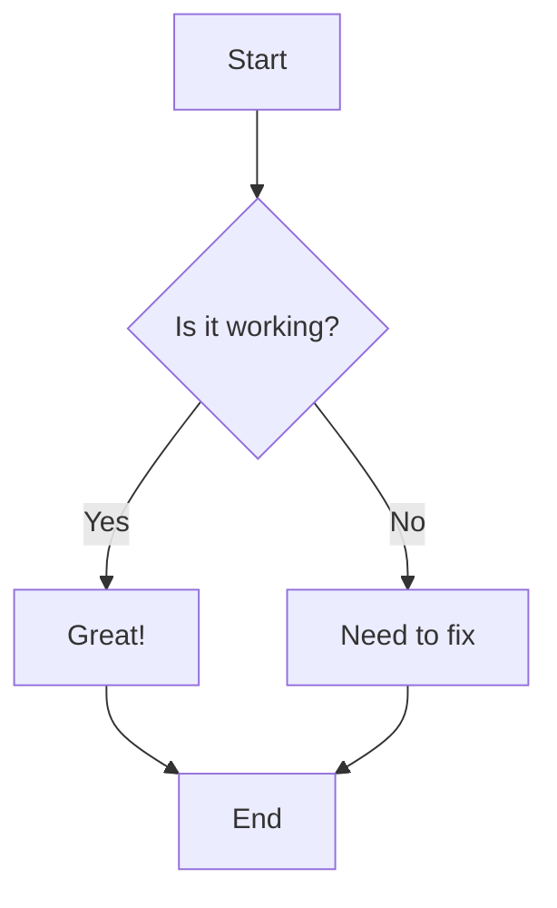
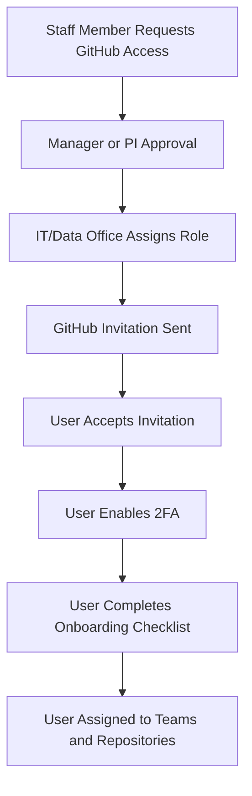

# Mermaid Test Page

This page tests if Mermaid diagrams are rendering correctly.

## Simple Flowchart



## Access Flow from SOP



## Data Classification Flow

```mermaid
flowchart TD
    A[Do You Want to Store Something?] --> B{Is it real-world data<br/>(patients, staff, hospital)?}
    B -->|Yes| C[STOP: Use Secure, IRB-Approved Storage<br/>Not GitHub]
    B -->|No| D{Is it synthetic or educational only?}
    D -->|Yes| E[GitHub Allowed<br/>Public or Private]
    D -->|No| F{Does it contain secrets<br/>(keys, passwords, tokens)?}
    F -->|Yes| G[STOP: Use Secret Manager<br/>Not GitHub]
    F -->|No| H[Code / Docs Only<br/>GitHub Allowed<br/>Private Recommended]
```

If you can see the flowcharts above as visual diagrams (not just text), then Mermaid is working correctly!