# Basic Rules

These are the essential rules everyone must follow when using GitHub in our organization.

## 🎯 Core Principles

1. **Safety First** - Never risk exposing sensitive data
2. **Least Privilege** - Only get access you actually need  
3. **Transparency** - Use pull requests so changes can be reviewed
4. **Accountability** - All actions are logged and auditable

## 📋 Quick Rules Summary

### ✅ What You CAN Do

- **Share code** for research and education
- **Collaborate** on open source projects
- **Store documentation** and tutorials
- **Use public datasets** and synthetic data
- **Create educational materials**

### ❌ What You CANNOT Do

- **Upload patient data** (PHI) or personal information (PII)
- **Store passwords** or secret keys
- **Share proprietary** company information
- **Commit sensitive** research data
- **Bypass security** requirements

## 🔒 Data Classification

Before uploading anything to GitHub, ask yourself:

```mermaid
flowchart TD
    A[Want to Upload Something?] --> B{Contains Real People's Data?}
    B -->|Yes| C[❌ STOP - Use Secure Storage]
    B -->|No| D{Contains Passwords/Keys?}
    D -->|Yes| E[❌ STOP - Use Password Manager]
    D -->|No| F{Is it Confidential?}
    F -->|Yes| G[❌ STOP - Use Private Systems]
    F -->|No| H[✅ OK for GitHub]
```

### Safe Data Types

- **✅ Public datasets** (already published)
- **✅ Synthetic data** (computer-generated, not real)
- **✅ Educational examples** (toy datasets)
- **✅ Open source code** (meant to be shared)
- **✅ Documentation** and tutorials

### Unsafe Data Types

- **❌ Patient records** (even "de-identified")
- **❌ Staff personal information** 
- **❌ Research participant data**
- **❌ Medical images** or test results
- **❌ Internal business data**

## 👥 Access Levels

### Viewer 👁️
- **Can**: Read and download
- **Cannot**: Make changes
- **Good for**: Students, external partners

### Contributor ✏️  
- **Can**: Suggest changes via pull requests
- **Cannot**: Directly edit main content
- **Good for**: Researchers, developers

### Maintainer 🔧
- **Can**: Approve changes and manage projects  
- **Cannot**: Access everything (still limited by need)
- **Good for**: Project leads, administrators

## 🛡️ Security Requirements

### Required for Everyone

1. **Two-Factor Authentication (2FA)**
   - Must be enabled on your GitHub account
   - Use authenticator app (Google, Authy, etc.)
   - Keep backup codes in safe place

2. **Strong Institutional Email**
   - Use your official work/school email
   - Never use personal email for work accounts

3. **Regular Training**
   - Complete annual security training
   - Stay updated on policy changes

### Best Practices

- **Review before committing** - double-check what you're uploading
- **Use private repositories** for internal work
- **Ask when unsure** - contact governance team with questions
- **Report problems immediately** - don't wait if something goes wrong

## ⚠️ Consequences of Violations

### Minor Violations
- **Additional training** required
- **Temporary access restrictions**
- **Manager notification**

### Major Violations  
- **Immediate access suspension**
- **Formal investigation** 
- **Potential disciplinary action**
- **Legal/compliance review** if needed

## 🔄 Policy Updates

- **Stay informed** - policies may change
- **Check regularly** - bookmark this page
- **Training required** - when major changes occur
- **Grandfather clauses** - existing work may need updates

## 📞 When You Need Help

### Before Acting
- **Read this guide** thoroughly
- **Check the FAQ** for common questions
- **Ask your supervisor** if unsure about data
- **Contact GitHub Tech Managers** for policy questions

### Quick Contacts
- **GitHub Tech Managers**: [GitHub Tech Managers](../help/contact.md)
- **Topics**: Policies, access, security, GitHub Actions, routine checks  
- **Administration/Billing**: [Administration team](../help/contact.md)
- **Response time**: 1-2 business days

## 📋 Compliance Checklist

Before using GitHub, make sure you:

- [ ] **Completed training** and passed quiz
- [ ] **Enabled 2FA** on your account
- [ ] **Understand data rules** - what's safe vs unsafe
- [ ] **Know your role** and permissions
- [ ] **Have supervisor approval** for access
- [ ] **Know who to contact** for help

---

**Next**: Learn about **[Data Safety](data-safety.md)** in detail 👉