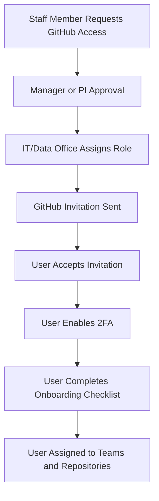

# 3. Access, Accounts, and Onboarding

This section defines how staff gain access and what they must do before using GitHub.

### 3.1 Access Request Flow

### 3.2 Onboarding Checklist

Every new GitHub user must complete **all** of the following:

- [ ] **GitHub account** created using institutional email (not personal).  
- [ ] **Invitation accepted** to the organization’s GitHub.  
- [ ] **Two-Factor Authentication (2FA)** enabled.  
  - Guide: https://docs.github.com/en/authentication/securing-your-account-with-two-factor-authentication-2fa  
- [ ] Read this **GitHub SOP**.  
- [ ] Completed **basic GitHub training links** in Section 2.3.  
- [ ] A **role** has been assigned (Viewer / Contributor / Maintainer).  
- [ ] Added to at least one **team** (e.g., “Clinical Education”, “Research Methods”, “Engineering”).  
- [ ] Assigned access to specific **repositories**.  
- [ ] Signed or acknowledged the **Data and Code Safety Agreement** (internal).  

### 3.3 Offboarding and Access Removal

When someone leaves (graduation, job change, contract end):

- [ ] Manager notifies IT/Data Office.  
- [ ] User is removed from **teams and repositories**.  
- [ ] User is removed from **organization** on GitHub.  
- [ ] Maintainers review any critical repositories for leftover ownership gaps.  

> Access removal should be completed **no later than the last working day**.

---
