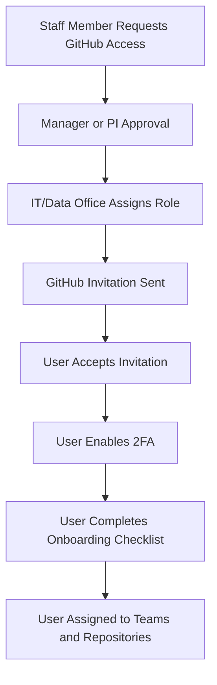

# GitHub Governance, SOP, and Training Manual  
### For Technical, Research, and Clinical Staff in an Educational / Healthcare Organization  
**Version:** 1.0  
**Status:** Draft for internal review  

---

## 0. How to Use This Document

This is a **master reference** that combines:

- ✅ A **Standard Operating Procedure (SOP)** for GitHub usage  
- ✅ A **training manual** for interactive teaching sessions  
- ✅ A **design spec** for GitHub automation (“robots”) and governance  

You can later extract from this file:

- A **short SOP** (2–4 pages)  
- **Slides** for an interactive training session  
- **Checklists** for onboarding and audits  
- **GitHub Actions workflows** based on the “Robots” section  

Use this master file as the **single source of truth**.

---

## Table of Contents

1. [Purpose, Scope, and Principles](#1-purpose-scope-and-principles)  
2. [GitHub Fundamentals (For All Staff)](#2-github-fundamentals-for-all-staff)  
   - 2.1 [What GitHub Is](#21-what-github-is)  
   - 2.2 [Key Concepts](#22-key-concepts)  
   - 2.3 [Beginner-Friendly Learning Path](#23-beginner-friendly-learning-path)  
3. [Access, Accounts, and Onboarding](#3-access-accounts-and-onboarding)  
   - 3.1 [Access Request Flow](#31-access-request-flow)  
   - 3.2 [Onboarding Checklist](#32-onboarding-checklist)  
   - 3.3 [Offboarding and Access Removal](#33-offboarding-and-access-removal)  
4. [Roles and Responsibilities](#4-roles-and-responsibilities)  
5. [Data Classification and GitHub Policy](#5-data-classification-and-github-policy)  
   - 5.1 [Data Classes](#51-data-classes)  
   - 5.2 [Data Storage Decision Flowchart](#52-data-storage-decision-flowchart)  
6. [Repository Governance](#6-repository-governance)  
   - 6.1 [When to Create a Repository](#61-when-to-create-a-repository)  
   - 6.2 [Public vs Private Repositories](#62-public-vs-private-repositories)  
   - 6.3 [Journals, Publications, and Open Science](#63-journals-publications-and-open-science)  
   - 6.4 [Repository Naming and Structure](#64-repository-naming-and-structure)  
   - 6.5 [Repository Lifecycle](#65-repository-lifecycle)  
7. [Standard Usage Workflows](#7-standard-usage-workflows)  
   - 7.1 [Viewer Workflow (Clinicians, Students)](#71-viewer-workflow-clinicians-students)  
   - 7.2 [Contributor Workflow (Analysts, Researchers)](#72-contributor-workflow-analysts-researchers)  
   - 7.3 [Maintainer Workflow (Engineers, Leads)](#73-maintainer-workflow-engineers-leads)  
8. [Branching, Pull Requests, and Commit Standards](#8-branching-pull-requests-and-commit-standards)  
9. [Automation and “Robots” (GitHub Actions)](#9-automation-and-robots-github-actions)  
10. [Security and Compliance Requirements](#10-security-and-compliance-requirements)  
11. [Routine Review and Audit Process](#11-routine-review-and-audit-process)  
12. [Incident Response](#12-incident-response)  
13. [Appendix A: Typical Use Cases](#13-appendix-a-typical-use-cases)  
14. [Appendix B: FAQ for Non-Technical Staff](#14-appendix-b-faq-for-non-technical-staff)  
15. [Appendix C: Learning Resources](#15-appendix-c-learning-resources)  
16. [Appendix D: Templates (Conceptual)](#16-appendix-d-templates-conceptual)  

---

## 1. Purpose, Scope, and Principles

### 1.1 Purpose

This document defines **how our organization uses GitHub** to support:

- Educational activities  
- Research and development  
- Publication and open science  
- Reproducible data science and AI  
- Internal tools and automation  

It is designed for a **mixed audience** of:

- Technical staff (engineers, data scientists, developers)  
- Research staff (PhD students, analysts, postdocs)  
- Clinical staff (physicians, nurses, clinical researchers)  

### 1.2 Scope

This SOP covers:

- Access to the organization’s GitHub  
- Roles and permissions  
- Repo creation and lifecycle  
- Safe use of GitHub with respect to clinical data and privacy  
- Use of GitHub for published journals and educational materials  
- Automation via GitHub Actions (“robots”)  
- Routine review, audits, and incident response  

### 1.3 Principles

We follow these core principles:

1. **Safety first**: No PHI/PII or sensitive clinical data in GitHub.  
2. **Least privilege**: Users get only the access they need.  
3. **Auditability**: Use branches, pull requests, and reviews so we can trace changes.  
4. **Reproducibility**: Encourage clean, documented code and clear versions for research.  
5. **Education-friendly**: Provide clear explanations and links for non-technical staff.  
6. **Automation-assisted**: Use robots to enforce rules consistently and reduce human error.  

---

## 2. GitHub Fundamentals (For All Staff)

This section helps **non-technical staff** understand GitHub and provides links for self-learning.

### 2.1 What GitHub Is

- A **platform for collaboration** on code and documents.  
- Built around **Git**, a version control system that tracks changes over time.  
- Supports **issues, pull requests, reviews, and automation**.  
- Useful for **education, research, and software development**.  

> GitHub is *not* an EHR system, not a database for real patient data, and not a general file dump.

### 2.2 Key Concepts

| Concept       | Simple Explanation                                        | Learn More |
|--------------|------------------------------------------------------------|-----------|
| Repository   | A "project folder" containing code, documents, etc.       | [Learn More](https://docs.github.com/en/repositories) |
| Commit       | A saved snapshot of changes with a message.               | [Learn More](https://www.atlassian.com/git/tutorials/what-is-version-control) |
| Branch       | A parallel copy of the code for safe experimentation.     | [Learn More](https://docs.github.com/en/pull-requests/collaborating-with-pull-requests/proposing-changes-to-your-work-with-pull-requests/about-branches) |
| Pull Request | A request to merge your changes into the main project.    | [Learn More](https://docs.github.com/en/pull-requests) |
| Issue        | A tracked task, bug, or feature request.                  | [Learn More](https://docs.github.com/en/issues) |
| Actions      | Automated workflows that run checks and tasks.            | [Learn More](https://docs.github.com/en/actions) |
| Markdown     | A simple way to format text on GitHub (headings, lists).  | [Learn More](https://www.markdownguide.org/basic-syntax/) |

### 2.3 Beginner-Friendly Learning Path

Recommended for new users:

1. **[Hello World on GitHub](https://docs.github.com/en/get-started/start-your-journey/hello-world)**  
   Start your GitHub journey with this interactive tutorial  
2. **[Introduction to GitHub Repositories](https://docs.github.com/en/repositories/creating-and-managing-repositories/about-repositories)**  
   Learn how to create and manage repositories  
3. **[Working with Pull Requests](https://docs.github.com/en/pull-requests)**  
   Master the pull request workflow  
4. **[Markdown Basics](https://www.markdownguide.org/basic-syntax/)**  
   Learn how to format text with Markdown  

These links can be assigned as **pre-work** for the training session.

---

## 3. Access, Accounts, and Onboarding

This section defines how staff gain access and what they must do before using GitHub.

### 3.1 Access Request Flow



### 3.2 Onboarding Checklist

Every new GitHub user must complete **all** of the following:

- [ ] **GitHub account** created using institutional email (not personal).  
- [ ] **Invitation accepted** to the organization’s GitHub.  
- [ ] **Two-Factor Authentication (2FA)** enabled.  
  - Guide: [Two-Factor Authentication Setup](https://docs.github.com/en/authentication/securing-your-account-with-two-factor-authentication-2fa)  
- [ ] Read this **GitHub SOP**.  
- [ ] Completed **basic GitHub training links** in Section 2.3.  
- [ ] A **role** has been assigned (Viewer / Contributor / Maintainer).  
- [ ] Added to at least one **team** (e.g., “Clinical Education”, “Research Methods”, “Engineering”).  
- [ ] Assigned access to specific **repositories**.  
- [ ] Signed or acknowledged the **Data and Code Safety Agreement** (internal).  

### 3.3 Offboarding and Access Removal

When someone leaves (graduation, job change, contract end):

- [ ] Manager notifies IT/Data Office.  
- [ ] User is removed from **teams and repositories**.  
- [ ] User is removed from **organization** on GitHub.  
- [ ] Maintainers review any critical repositories for leftover ownership gaps.  

> Access removal should be completed **no later than the last working day**.

---

## 4. Roles and Responsibilities

We use a **role-based model** to control permissions.

| Role        | Typical People                                | Permissions (GitHub)                     | Responsibilities |
|-------------|-----------------------------------------------|------------------------------------------|------------------|
| Org Owner   | Technical lead, compliance representative     | Full admin across organization           | Governance, org-wide settings, automation, incident response |
| Repo Admin  | PI, project lead, senior engineer             | Admin for specific repository            | Manage repo settings, enable robots, assign maintainers |
| Maintainer  | Engineer, experienced analyst                 | Write, review, merge PRs                 | Code review, enforcing standards, triage issues |
| Contributor | Analyst, student, research assistant          | Create branches & pull requests          | Implement changes, follow SOP, respond to reviews |
| Viewer      | Clinician, stakeholder, external collaborator | Read-only access                         | Read content, open issues (if allowed), give feedback |

**Principle of least privilege:** default to **Viewer** or **Contributor** unless there is a clear justification for Maintainer or Admin.

---

## 5. Data Classification and GitHub Policy

GitHub is **not a data warehouse**. Treat GitHub primarily as a code, documentation, and configuration repository.

### 5.1 Data Classes

We distinguish several classes of content:

1. **Class A — Public Educational Content**  
   - Slides, tutorials, toy examples, fully synthetic datasets.  
   - No reference to real patients or internal identifiers.  
   - **GitHub:** Public repo is allowed and encouraged.

2. **Class B — Internal Non-Sensitive Content**  
   - Internal tutorials, teaching scripts, generic data processing code.  
   - No PHI, no internal URLs or passwords.  
   - **GitHub:** Private repo within organization.

3. **Class C — Confidential Computational Assets (No PHI)**  
   - ETL code, data pipelines, model training scripts, configuration for internal systems.  
   - May reference internal concepts but must not expose secrets or URLs that reveal internal topology.  
   - **GitHub:** Private repos only; stronger scrutiny and robots.

4. **Class D — Regulated Data (PHI/PII, Clinical Data)**  
   - Any real patient-level data, even if “de-identified” but still potentially re-identifiable.  
   - Audit logs, clinical notes, imaging data, lab results, etc.  
   - **GitHub:** **Never allowed**. Must be stored in IRB-approved secure environments.

5. **Class E — Secrets and Credentials**  
   - API keys, passwords, SSH keys, tokens, VPN configs.  
   - **GitHub:** **Never allowed**, even in private repos.

### 5.2 Data Storage Decision Flowchart

```mermaid
flowchart TD
    A[Do You Want to Store Something?] --> B{Is it real-world data<br/>(patients, staff, hospital)?}
    B -->|Yes| C[STOP: Use Secure, IRB-Approved Storage<br/>Not GitHub]
    B -->|No| D{Is it synthetic or educational only?}
    D -->|Yes| E[GitHub Allowed<br/>Public or Private]
    D -->|No| F{Does it contain secrets<br/>(keys, passwords, tokens)?}
    F -->|Yes| G[STOP: Use Secret Manager<br/>Not GitHub]
    F -->|No| H[Code / Docs Only<br/>GitHub Allowed<br/>Private Recommended]
```

If there is **any doubt**, treat the content as **Class D (Regulated)** and **do not upload** to GitHub.

---

## 6. Repository Governance

### 6.1 When to Create a Repository

Create a new repository when:

- You start a **new project** with its own lifecycle (e.g., a research study, a teaching module, a software tool).  
- You need a dedicated location for **journal publication code release**.  
- You want to create a **reusable library** for multiple projects.  

Do **not** create a new repo for:

- Temporary scratch work.  
- One-off data exploration (use local workspace or internal notebooks).  
- Storing data dumps.  

### 6.2 Public vs Private Repositories

#### Public Repos — Allowed When

- Content is **pure code, documentation, and synthetic examples**.  
- There are no **internal system identifiers** or secrets.  
- The repo is meant for **publication** or **open education**.  
- The content has passed **robot checks** and human review.

#### Public Repos — Not Allowed For

- Anything that indirectly reveals internal hospital/system details.  
- Code tightly coupled to internal EHR or data warehouse configurations.  
- Any content that is under a commercial NDA or IP restriction.  

#### Private Repos

Use private repositories for:

- Internal tools and pipelines.  
- Work-in-progress research code.  
- Teaching materials that are not yet public.  
- Code that references internal systems (but still sanitized).  

> **Reminder:** “Private” does **not** mean it’s safe for PHI or secrets.

### 6.3 Journals, Publications, and Open Science

Many journals require code availability. Use the following pattern:

1. Develop code in an **internal (private) repo**.  
2. After acceptance or at submission time, create a **clean public repo** for the paper:  
   - Remove internal references, debugging traces, and hospital-specific details.  
   - Include **only synthetic example datasets** that demonstrate usage.  
   - Add a `LICENSE` (MIT, Apache 2.0, etc.).  
   - Add a `CITATION.cff` file describing how to cite the work.  
3. Run the **Publication Readiness** GitHub Action (see Section 9).  
4. Tag a version (e.g., `v1.0.0`) and share that with the journal.  

### 6.4 Repository Naming and Structure

#### Naming Conventions

- `proj-<shortname>-<year>` for project repos.  
- `edu-<course>-<topic>` for teaching repos.  
- `paper-<shortname>-<journal>` for publication repos.  

Examples:  

- `proj-icu-prediction-2025`  
- `edu-intro-ml-healthcare`  
- `paper-mortality-risk-bmj`  

#### Mandatory Files and Folders

Every repository must have at least:

```text
README.md
LICENSE               # Required for public repos, strongly recommended everywhere
CODEOWNERS            # Defines who reviews and owns what
.gitignore
docs/                 # Documentation, design notes, diagrams
.github/workflows/    # GitHub Actions (robots)
SECURITY.md           # How to report security issues
```

### 6.5 Repository Lifecycle

Each repo has a lifecycle: **Active → Maintenance → Archived → Deleted (if needed)**.

```mermaid
flowchart TD
    A[Repo Created] --> B[Active Development]
    B --> C[Maintenance Mode<br/>(Low Activity)]
    C --> D[Archived<br/>(Read-only)]
    D --> E[Optional Deletion<br/>(After Policy Period)]
```

- **Active**: frequent commits and ongoing development.  
- **Maintenance**: occasional updates; still supported.  
- **Archived**: read-only; preserved for reference or reproducibility.  
- **Deleted**: only after policy-defined retention and approvals.

---

## 7. Standard Usage Workflows

### 7.1 Viewer Workflow (Clinicians, Students)

Most clinicians and some students will use GitHub as **read-only viewers**.

Typical tasks:

1. Open a repository.  
2. Read the `README.md` and relevant documentation.  
3. Browse notebooks or examples.  
4. Optionally, open **Issues** to request features or report problems (if permitted).  

No Git knowledge is required to **view** content. Everything can be done through the web UI.

### 7.2 Contributor Workflow (Analysts, Researchers)

```mermaid
flowchart TD
    A[Identify Task or Issue] --> B[Create Branch<br/>feature/task-name]
    B --> C[Make Changes Locally<br/>or via Web Editor]
    C --> D[Commit Changes with Clear Message]
    D --> E[Push Branch to GitHub]
    E --> F[Create Pull Request<br/>(PR) to main/dev]
    F --> G[Automatic Robots Run<br/>(PHI, Security, Structure)]
    G --> H{All Checks Passed?}
    H -->|No| I[Fix Issues and Update PR]
    H -->|Yes| J[Reviewer Approves PR]
    J --> K[Maintainer Merges PR]
```

Key rules for contributors:

- Work in **branches**, not directly on `main`.  
- Use **meaningful commit messages**.  
- Fill in the **PR template** (see Section 16).  
- Respond constructively to **review comments**.  

### 7.3 Maintainer Workflow (Engineers, Leads)

Maintainers are responsible for:

- Triage of issues and pull requests.  
- Ensuring robots are enabled and enforced.  
- Reviewing PRs for code quality and policy compliance.  
- Coordinating releases and tags (especially for publications).  

Typical PR review steps:

1. Confirm scope matches the linked issue.  
2. Check code style and clarity.  
3. Confirm **no data files** or large binaries are introduced.  
4. Check that **robots passed** (PHI, security, structure).  
5. Approve or request changes.  

---

## 8. Branching, Pull Requests, and Commit Standards

### 8.1 Branch Naming

- `feature/<short-description>` (e.g., `feature/add-calc-features`)  
- `fix/<bug-or-issue-id>` (e.g., `fix/issue-42-hidden-bug`)  
- `docs/<topic>` (e.g., `docs/update-readme`)  

### 8.2 Commit Messages

Recommended style:

- `feat: add new ICU risk score computation`  
- `fix: correct indexing error in lab table`  
- `docs: expand explanation of model inputs`  
- `refactor: simplify ETL pipeline structure`  

### 8.3 Pull Request Requirements

Every PR should:

- Have a **descriptive title**.  
- Reference related issue(s): e.g., `Closes #42`.  
- Include a summary of changes and testing performed.  
- Pass all GitHub Actions (robots) before merge.  
- Be reviewed by at least **one maintainer** (more for sensitive repos).  

Self-merge is generally **not allowed**, except for specific maintainers on low-risk repos.

---

## 9. Automation and “Robots” (GitHub Actions)

We use GitHub Actions to automatically enforce some rules.

### 9.1 Design Goals for Robots

- Detect PHI/PII and block unsafe changes.  
- Prevent secrets from being committed.  
- Enforce basic repo structure and metadata.  
- Support publication readiness and tagging.  
- Reduce manual, repetitive checks for maintainers.

### 9.2 Types of Robots

1. **PHI/PII Scanner (`phi_scan.yml`)**  
   - Trigger: on pull request.  
   - Checks for patterns such as:  
     - Date-of-birth formats (e.g., `YYYY-MM-DD`).  
     - 8–10 digit numeric IDs that look like MRNs.  
     - ICD-10 patterns like `A00`, `E11.9`, etc.  
     - Email, phone, and address formats.  
     - FHIR “Patient” resources in JSON/YAML.  
   - If any suspicious pattern is found, the PR is marked **failed**.

2. **Secrets Scanner (`secrets_scan.yml`)**  
   - Trigger: on pull request and on push to default branch.  
   - Uses pattern-based and entropy-based detection to find:  
     - API keys, passwords, tokens, SSH keys.  
   - If secrets are found:  
     - PR is blocked.  
     - Maintainers are notified to rotate keys and scrub history.

3. **Repo Structure Checker (`repo_structure.yml`)**  
   - Trigger: on pull request and nightly.  
   - Ensures that required files exist:  
     - `README.md`  
     - `LICENSE` (for public repos)  
     - `CODEOWNERS`  
     - `.gitignore`  
   - Fails the check if any are missing (for relevant repos).

4. **Publication Readiness Check (`publication_ready.yml`)**  
   - Trigger: on tag creation (e.g., `v*.*.*`) or manual dispatch.  
   - Checks that:  
     - A `CITATION.cff` file exists.  
     - `LICENSE` is present and valid.  
     - No data folders are present beyond allowed examples.  
     - The repo passes a PHI scan.  
   - If all pass, the tag is considered “ready for journal”.

5. **Labeler / Classifier (`labeler.yml`)**  
   - Trigger: on pull request and on new repository creation (via API or scripts).  
   - Automatically applies labels such as:  
     - `education`  
     - `pipeline`  
     - `publication`  
     - `machine-learning`  
   - Helps search and governance dashboards.

> In the future, we can add more robots (e.g., linting, testing, documentation coverage) as our projects mature.

---

## 10. Security and Compliance Requirements

All users must follow these security rules:

- **Two-Factor Authentication is mandatory** for all organization members.  
- Do not commit **secrets** (passwords, tokens) to any repository.  
- Do not commit **clinical data** or anything resembling PHI/PII.  
- Use **branch protection rules** on main branches (`main`, `master`).  
- Any exception to policies must be explicitly approved by compliance/leadership and documented.

---

## 11. Routine Review and Audit Process

We maintain GitHub hygiene via **automated checks** and **manual reviews**.

```mermaid
flowchart TD
    A[Monthly Automated Scans<br/>(Robots)] --> B{Issues Found?}
    B -->|No| C[No Action Needed]
    B -->|Yes| D[Maintainers Fix and Document]

    C --> E[Quarterly Manual Review<br/>(By Maintainers + Lead)]
    D --> E

    E --> F{Repo Still Active?}
    F -->|Yes| G[Remain Active or Maintenance Mode]
    F -->|No| H[Archive Repo<br/>Mark as Read-Only]

    H --> I[Optional Deletion After Policy Retention Period]
```

### 11.1 Monthly Automated Checks

- PHI/PII scans on all branches.  
- Secrets scans.  
- Structure checks.  

### 11.2 Quarterly Manual Review

For each important repo, maintainers:

- Review open issues and PRs.  
- Confirm robots are still configured appropriately.  
- Decide whether to remain active or move to maintenance.  

### 11.3 Annual Archival / Cleanup

- Repos inactive for **>12 months** may be **archived**.  
- Repos irrelevant or duplicated can be marked for **deletion** after retention rules.

---

## 12. Incident Response

If something goes wrong (e.g., sensitive data committed):

1. **Stop and Report**  
   - Do **not** try to fix it quietly.  
   - Notify: Org Owners + compliance/security contact.

2. **Technical Containment**  
   - Temporarily restrict repo access if needed.  
   - Use GitHub tools to remove sensitive data from history.  

3. **Key Rotation** (if secrets exposed)  
   - Revoke and regenerate any exposed keys or tokens.  

4. **Documentation**  
   - File a formal incident report:  
     - What happened?  
     - When?  
     - Who was involved?  
     - What was exposed?  
     - What actions were taken?  

5. **Review and Improve**  
   - Update robots or SOP if needed to prevent recurrence.

---

## 13. Appendix A: Typical Use Cases

### A.1 Education Repo Example

- **Goal:** Teach clinicians basic machine learning.  
- **Content:**  
  - Jupyter notebooks with synthetic datasets.  
  - Slides and Markdown notes.  
  - Diagrams of model concepts.  
- **Repo Type:** Public or private depending on audience.  
- **Constraints:** No real patient data, no hospital specifics.

### A.2 Research Project Repo

- **Goal:** Develop and evaluate a predictive model.  
- **Content:**  
  - Code for data preprocessing, modeling, and evaluation.  
  - Documentation on methodology.  
- **Repo Type:** Private during development; public “paper repo” later.  
- **Data:** Stored separately in secure research environment.

### A.3 Clinical Pipeline Pseudocode

- **Goal:** Document the logic of a clinical decision support pipeline.  
- **Content:**  
  - High-level pseudocode.  
  - Flowcharts and architecture diagrams.  
- **Repo Type:** Private.  
- **Constraints:** No internal addresses, no query examples with real identifiers.

---

## 14. Appendix B: FAQ for Non-Technical Staff

**Q1: Do I need to install Git on my computer to use GitHub?**  
**A:** No. You can view repositories, read documents, and comment using just a web browser.

**Q2: Can I upload PowerPoint slides or PDFs?**  
**A:** Yes, as long as they contain **no PHI/PII** and no confidential internal information that is not meant to be shared.

**Q3: Can I upload screenshots of the EHR to show examples?**  
**A:** Absolutely not. Screenshots almost always contain PHI or sensitive information and are forbidden on GitHub.

**Q4: What if I’m not sure whether something is allowed?**  
**A:** If in doubt, treat it as **not allowed** and ask a maintainer or compliance contact.

**Q5: Do I have to understand pull requests and branches?**  
**A:** If you are only a **viewer**, no. If you are a **contributor**, you should learn the basics (Section 2.3 links help with that).

---

## 15. Appendix C: Learning Resources

A curated list of useful resources:

- [GitHub Learning Path for Beginners](https://docs.github.com/en/get-started/start-your-journey) -  
  Complete beginner's guide to using GitHub  
- [Git and GitHub Introduction](https://guides.github.com/introduction/git-handbook/) -  
  Essential Git concepts and GitHub workflow  
- [Markdown Live Preview Playground](https://www.markdownguide.org/tools/) -  
  Practice formatting with live preview  

---

## 16. Appendix D: Templates (Conceptual)

These templates can be extracted into separate files per repository.

### 16.1 Example README Structure

```markdown
# Project Title

## Overview
Short description of the project and its goals.

## Usage
How to run the code or use the materials.

## Data
Describe data **conceptually**. Do not include PHI/PII or real datasets.

## Installation
Steps to set up the environment.

## Contributing
How others can propose changes (branches, PRs, code style).

## License
Reference to LICENSE file.
```

### 16.2 Example PR Template (Conceptual)

```markdown
## Summary

- Briefly describe the changes in this PR.

## Related Issues

- Closes #ISSUE_ID

## Changes

- [ ] Code changes
- [ ] Documentation updates
- [ ] Tests added/updated

## Checklist

- [ ] No PHI/PII or secrets added
- [ ] Tests pass locally
- [ ] Documentation updated (if needed)
```

---

_End of master GitHub governance and training manual._
